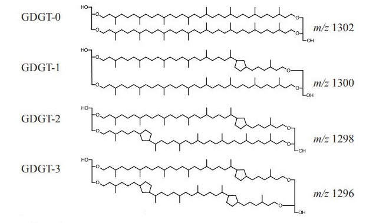

```{r setup, include = FALSE}
library(tidyverse)
library(broom)
library(stringr)
library(latex2exp)
library(readxl)

knitr::opts_chunk$set(
  dev = c("png", "pdf"), 
  dev.args = list(pdf = list(encoding = "WinAnsi", useDingbats = FALSE)),
  fig.keep = "all", fig.path = file.path("fig_output", "fig_prefix_"))
source(file.path("scripts", "functions.R"))

```
# About this assignment
* Technical Requirements
  + Just a browser to use the binder version!
  + If you choose to use this assignment on your own system you will need:
    + R version 3.5.1
    + RStudio version 1.2.981
    + tidyverse library version 1.2.1
    + broom library version 0.5.0
    + stringr version 1.3.1
    + readxl version 1.1.0
* Conceptual Prerequisites
  + Students should have a working knowledge of least squares fitting/linear regression of two variables. 
  + Students should have a working knowledge of methods for evaluating statistical models and quantifying error. 
  + Students should have a general understanding of paleo-ocean temperature proxies. 
* Learning Goals
  + Students will learn computational tools that make calculating, plotting, and evaluating linear regressions fast and efficient. 
  + Students will learn to compare many linear regressions of a multivariate data set to select an optimal model. 
  + Students will learn to make predictions from a linear regression model and quantify the error associated with the predictions. 
  + Students will compare several GDGT paleo temperature proxy calibrations and their associated errors. 

# Introduction to linear regression in R
You should be familiar with the mathematics and important statistics involved with linear regression. In this assignment you will use R to calculate and evaluate many linear regressions quickly. R was specifically designed for statistical computing, and it offers many helpful tools and functions for regression. This section will introduce some of the tools that will be helpful later in this assignment. 

## Linear regression in R: lm()
Linear regressions in R can be quickly calculated using the function `lm()`, which stands for "linear model". You should view the documentation for `lm()` now by entering `?lm` at the command line or searching lm in the RStudio help pane (and note that you can find documentation for any R function this way).

`lm()` requires a *formula*, which defines the variables, and these can be data values themselves (i.e. a numeric vector) or variable names which appear the second argument, *data*. In general it is more effective to use variable names in the *formula* and provide the data in *data* because this makes it easier to use the model to make predictions on new data later. 

Let's load a dataset of water chemistry measurements from a hot spring in Yellowstone National Park [USGS 2009-2013](https://www.usgs.gov/media/files/yellowstone-water-chemistry-final-data-2009-2013)) and plot pH vs. Temperature. 

Below is a code chunk. You can execute it by clicking the green triangle in the upper right-hand corner. Be sure that each chunk runs successfully before you move on to the next one.

```{r,  warning = FALSE}

# Read in Ojo Caliente dataset (USGS 2009-2013)
# https://www.usgs.gov/media/files/yellowstone-water-chemistry-final-data-2009-2013)

ojo <- read_excel(file.path("data", "ojo_caliente_data.xlsx"), 
                  na = "---", 
                  col_types = c(rep(c("text", "date", "text"), each = 2), 
                                rep("numeric", 88))) %>% 
  
  select_if(function(x) any(!is.na(x))) # Remove empty columns

ojo
```


Now plot temperature versus pH.
```{r warning = FALSE}
ojo %>% 
  ggplot(aes(x = `Temperature (°C)`, y = `pH (best)`)) + 
  geom_point() 
```


Plot some more combinations of variables from the Ojo Caliente data set and choose a correlation to fit with a linear regression. 

```{r warning = FALSE}
ojo %>% # Hint: explore ojo by running `ojo` on its own.
  ggplot(aes(x = ???, y = ???)) + # Hint: Use backticks (``) around variable names.
  geom_point() 
```

Once you've chosen the variables you would like to regress, use `lm()` to calculate a linear regression. `glance()` is a useful function for printing an overview of the model. 
```{r}
# Simple linear models have the form y ~ x
ojo_lm <- lm(??? ~ ???, data = ojo) # Hint: Same variables as above. 

glance(ojo_lm)
```

Now let's plot your linear regression with the data. We've provided a function `geom_lm()` that adds a fit, as well as confidence intervals ($1\sigma$, blue) and prediction intervals ($1\sigma$, red), for convenience. 
```{r warning = FALSE}
ojo %>% 
  ggplot(aes(x = ???, y = ???)) + # Hint: Same variables as above. 
  geom_point() +
  geom_lm(ojo_lm) # Hint: geom_lm() needs your linear model. 

```


# Applying linear regression to a paleotemperature proxy calibration ($TEX_{86}^L$)

Biomarker-based paleothermometry is based upon the biochemical principle that microorganisms adjust the rigidity of their cell membrane structures in response to temperature. A popular biomarker paleothermometer is based on the relative abundances of archaeal glycerol dialkyl glycerol tetraethers (GDGTs). These molecules consist of two 40-carbon isoprenoidal chains (made up of isoprene units) that have a varying number of cyclopentane rings. These chains are connected by ether bonds to terminal glycerol groups (see diagram below). With increasing temperature, source archaea (namely *Thaumarcheota*), produce GDGTs with more rings because these structures have higher melting points (e.g. are more stable at warm temperatures). 

{width=70%}


The $TEX_{86}$ ratio is a mathematical representation of the degree of cyclization of GDGTs. This ratio can be empirically calibrated to temperature, typically with a linear relationship for use as a paleotemperature proxy. An alternate form of the $TEX_{86}$ ratio, $TEX_{86}^L$, was proposed by Kim et al. 2010 for better prediction at low temperatures. 

$$
TEX_{86}^L = log(\frac{[GDGT-2]}{[GDGT-1] + [GDGT-2] + [GDGT-3]})
$$

In this exercise, you will find the best empirical $TEX_{86}^L$ local temperature calibration for surface sediment in Iceland. You will then apply this calibration to a core and compare your local calibration to existing regional calibrations previously published in the literature. 

## Import and manipulate data

Run this chunk of code to import $TEX_{86}^L$ data from surface sediment in Iceland.

If you open the dataframe Iceland_TEX86_data, you can see $TEX_{86}^L$ ratios of surface sediment from various sites in Iceland are recorded. Samples with a "Surface sed ID" of 313-347 are from Harning et al. (2018); samples with a "Surface sed ID" of 1-13 are from Rodrigo-Gámiz et al.(2015). Also included are the climatological mean temperatures for these sites from Locarnini et al. (2010).

```{r warning = FALSE, message = FALSE}
#load file containing Iceland surface sediment TEX86 ratios and sea surface temperatures

Iceland_TEX86_data <- read_csv(file.path("data", "TEX86_Iceland_calibration_2.csv"), col_names = TRUE)

Iceland_TEX86_data
```

*Thaumarcheota*, the major producers of GDGTs, are ubiquitious in the world's oceans. These organisms are nitrifiers, oxidizing ammonium with oxygen, and thus can be found anywhere in the water column where these compounds are present. While *Thaumarcheota* can be found in soils, the concentrations of GDGTs produced in soil environments are typically much lower compared to marine environments. Most $TEX_{86}$ calibrations use annual sea surface temperature, assuming that the source of GDGTs is planktonic *Thaumarcheota* and that these microorganisms are responding to surface temperatures. 

1. Do you think it is valid to assume that the *Thaumarcheota*'s lipids will respond to the average annual sea surface temperature? Why or why not?

Answer: 

In the dataframe you loaded above, you have been provided seasonal and annual temperature depth integrations. Run the following code chunk to generate linear regressions for each temperature profile.

```{r warning = FALSE}
#filter dataframe to include just response and predictor variables to use downstream
T_profiles <- Iceland_TEX86_data[,5:80]

#create dataframe with response and predictor columns for regression
df <- T_profiles
response_var <- "TEX86L"

vars <- tibble(response=response_var,
               predictor= paste0("`", setdiff(names(df), response_var), "`")) # Make the col names behave

#create string of formulas to feed to lm() function
formulas <- paste0(response_var, "~", vars$predictor) # Just the variables, not the lm() part

models <- data_frame(formulas) %>% # pass formulas to lm()function
    mutate(model = map(formulas, ~  lm(as.formula(.), data = df))) %>%
  unnest(map(model, glance), .drop=T)

#pull out seasons from formula column
models <- models %>% 
  mutate(
  season = case_when(
  grepl("Ann", .$formulas) ~ "Annual",
  grepl("Wint", .$formulas, ignore.case = TRUE) ~ "Winter",
  grepl("Spring", .$formulas) ~ "Spring",
  grepl("Fall", .$formulas) ~ "Fall",
  grepl("Summer", .$formulas) ~ "Summer"
  )) %>% 
  mutate(depthint = ifelse(grepl("SST", formulas), 
                           "SST", 
                           str_extract(formulas, "0.*m"))) %>% 
  mutate(depth = ifelse(grepl("SST", depthint), 
                           0, 
                           as.numeric(substring(depthint, 3, nchar(depthint) - 1))))

models
```

Take a look at the `models` data frame this has generated to explore the statistics that have been calculated for all of the models. 

## Plotting $r^2$ versus integrated depth for each seasonal temperature profile

To compare the regressions for each temperature profile, plot the **adjusted** $r^2$ value of each regression vs depth, using color to denote season. 

```{r warning = FALSE}
models %>% 
  arrange(depth) %>% 
  ggplot(aes(x = ???, y = ???, color = ???)) + # Hint: what variables should be in the plot?
  geom_line() + 
  geom_point() + 
  coord_flip() + 
  xlim(200,0) +
  xlab(???) + 
  ylab(TeX('adjusted $r^2$'))
  
```

2. Which season(s) and integrated depth(s) of temperature has the most robust relationship with GDGT cyclization?

Answer: 

3. What can you infer about GDGT production and preservation at these sites based on how the correlation depends on season and depth integration?

Answer: 

## Calculate the most robust regression for modern Iceland surface sediment

4. Using your plot from the previous problem, choose one integrated depth and season for your local calibration. Justify your choice.

Answer: 


Use the function lm() to run a linear regression for your chosen temperature profile and save this regression as "best_model." Then plot your regression model using geom_lm().

```{r warning = FALSE}
# Reminder: lm format is lm(y ~ x)
best_model <- lm(??? ~ ???, data = df)


df %>% 
  ggplot(aes(x = ???, y = ???)) + 
  geom_lm(best_model) +
  geom_point(color = "blue") + 
  xlab(TeX('$TEX^L_{86}$')) +
  ylab(???)
  
```

## Comparing models

{width=70%}

{width=70%}

Above are two temperature calibrations for $TEX_{86}^L$. The first is from Kim et al. 2010, which uses global SST. The second is an updated calibration from Kim et al. 2012 which uses an annual 200 m depth integration.

5. How do these calibrations compare with your local calibration (e.g. temperature range, $r^2$)? How can you explain these differences?

Answer:

6. From examining the plots above, what would you estimate the overall error associated with a temperature estimate from $TEX_{86}^L$ to be? How does this compare to your local model?

Answer:

7. Would the uncertainty estimate vary depending on the measured $TEX_{86}^L$ value?

Answer:


## Application of models to an Iceland core

Let's apply each of these calibrations to a sediment core from Iceland.

Import the sediment core data from Harning et al. (2018). If you open the dataframe, you can see that each core sample has an associated depth, age, and $TEX_{86}^L$ ratio. Ages were extrapolated from radiocarbon dating of mollusks in the core. 

```{r}
data <- read_excel(file.path("data", "TEX86_record_NIS.xlsx"), col_names = TRUE)

data
```

First, use the $TEX_{86}^L$ ratio, your linear regression, and the regressions from Kim et al. (2010) and (2012) to calculate a GDGT-derived temperature. Then, input the standard residual error associated with your model into the dataframe. Finally, plot the derived temperature and associated error vs. age.

```{r warning = FALSE}
data <- data %>% mutate(
  kim2010 = ???, # Hint: calculate the temperature estimate from the relevant equation. 
  kim2012 = ???, 
  best_model = ???
) %>% 
  gather(model, estimate, kim2010:best_model) %>% 
  mutate(error = case_when(
    model == "kim2010" ~ ???, # Hint: this is the contant error cited in the publication.
    model == "kim2012" ~ ???,
    model == "best_model" ~ sd(best_model$residuals) # an lm() object contains the residuals which can be accessed with $, and we can calculate the standard deviation with sd().
  ))

data %>% 
  ggplot(aes(x = ???, # Hint: this should be the age of the sample. 
             y = ???, # Hint: this should be the temperature estimate.
             color = ???, # Hint: group by which model the estimate is calculated from
             ymin = ??? - ???, # Hint: how can you calculate the values for the error bars?
             ymax = ??? + ???)) + 
  geom_line() +
  geom_point() +
  geom_errorbar() +
  labs(
    x = "Year",
    y = "Estimated Temperature (°C)"
  )

```

8. What effect does applying a local calibration have on the relative and absolute GDGT-derived temperatures?

Answer:

# References
Harning, D.J., Sepúlveda, J., Cabedo-Sanz, P., Andrews, J.T., Belt, S.T., Dildar, N., Geirsdóttir, Á., Miller, G.H.(2018). Sea ice control on winter subsurface temperatures of the North Iceland Shelf over the last millennium. Paleoceanography and Paleoclimatology, submitted. 

Kim, J. H., Crosta, X., Willmott, V., Renssen, H., Bonnin, J., Helmke, P., . Sinninghe Damst?, J. S. (2012). Holocene subsurface temperature variability in the eastern Antarctic continental margin. Geophysical Research Letters, 39(6), 3-8. https://doi.org/10.1029/2012GL051157

Kim, J. H., van der Meer, J., Schouten, S., Helmke, P., Willmott, V., Sangiorgi, F., . Damst?, J. S. S. (2010). New indices and calibrations derived from the distribution of crenarchaeal isoprenoid tetraether lipids: Implications for past sea surface temperature reconstructions. Geochimica et Cosmochimica Acta, 74(16), 4639-4654. https://doi.org/10.1016/j.gca.2010.05.027

Locarnini, R.A., Mishonov, A.V., Antonov, J.I., Boyer, T.P., Garcia, H.E., Baranova, O.K., Zweng, M.M., Johnson, D.R. (2010). World Ocean Atlas 2009, Volume 1: Temperature. S. Levitus, Ed. NOAA Atlas NESDIS 68, U.S. Government Printing Office, Washington, D.C., 184 pp

Rodrigo-Gámiz, M., Rampen, S.W., de Haas, H., Baas, M., Schouten, S., Sinninghe-Damsté, J.S. (2015). Constraints on the applicability of the organic temperature proxies Uk37´, TEX86 and LDI in the subpolar region around Iceland. Biogeosciences 12, 6573-6590.

Tierney. J. (2012). Reconstructing Earth’s Deep-Time Climate—The State of the Art, The Paleontological Society Papers, Volume 18, Linda C. Ivany and Brian T. Huber (eds.),
pp. 115–131.
